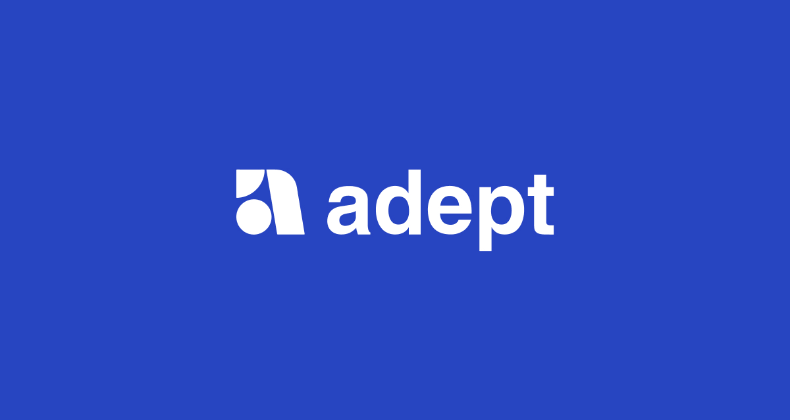

**NB:** This document is still very much a work in progress and constantly evolving. Please read the notes below to find out how to contribute.

## Etymology

The word “adept” is derived from the Latin word *Adeptus* which means “one who has attained”. Moreover, an **adept** can be described as an individual that has attained a specific level of knowledge, skill, or aptitude within a given field.

## What is Adept?

[Adept](https://adeptdao.org/) will be a platform that empowers digital creators to build their decentralized communities. As opposed to existing [DAO](https://cointelegraph.com/ethereum-for-beginners/what-is-a-decentralized-autonomous-organization-and-how-does-a-dao-work) tooling platforms we will take a user-first approach providing users with all the necessary tools and components to build and manage their community. 

We will make no assumptions about the user's prior background knowledge or experience with web3, blockchain, or crypto. This is an imperative approach we have chosen to take in order to limit any potential barriers to entry for the everyday individual.
 
Our objective is to create an ecosystem where people that share the same passions, interests and goals can connect, collaborate and earn.

## Paradigm Shift

The world as we know it is changing, and recent global events have proven that some companies can operate just as or even more efficiently with remote personnel.

Due to the current global climate, we have also been witnessing more and more people leave their full-time employment to pursue more meaningful and flexible work in terms of working hours. More than ever before, people are striving for a more optimal work-life balance rather than pursuing more financially appealing opportunities.

Traditionally after obtaining a degree, people would seek employment within a company typically working in an area of expertise that was reflective of what they studied. They would then work from 9-5 for the next 40 years, slowly working their way up within an organization until retirement. This is how it has been.

DAOs can fundamentally change how people work and earn a living. The worker of tomorrow will be able to earn money by contributing to multiple DAOs, making use of their varied skill-set within a thriving ecosystem without borders and one that isn’t bound by time. This is the future of web3.
DAOs will give individuals the opportunity to pursue multiple careers simultaneously in a way that has never been done before. For example, Tom is a member of a DAO, his primary skills are photography so he regularly submits photos as part of community bounties, in exchange he is rewarded in tokens for that community. He also has an interest in programming but he’s still very much a beginner. He joins another DAO where he is able to make micro contributions and is able to earn tokens for that DAO also. Tom is an avid copywriter and regularly contributes copy to two other DAOs. He is able to do all of this of his choosing. He gets paid on time without disputes as all of this is governed by [smart contracts](https://www.investopedia.com/terms/s/smart-contracts.asp).

## The DAO Trilemma

As an utilization of Blockchain technology, the DAO governance model also has three problems have to address: Decentralization, Identity, and Flexibility.

Decentralization: Decentralization in terms of DAO means that rights and obligations are decentralized into the community. By decentralization, we can utilize most of the collective wisdom and provide the most incentives for the community's participation in governance. At the same time, Full-Decentralized governance means that the DAO system will have no private, first-mover advantage in any choice outside of the DAO (outsiders can know about our motion, strategy and take action accordingly against that DAO)

Identity: To prevent harmful vote benefits for a specific group of people conducting a raid (or DDOS attack) by creating many fake addresses, and identities, the DAO governance model must ensure the voting process carries the real intelligence of community members. At the same time, community members will have a privacy concern if we do one address - one identity KYC.

Flexibility: A DAO governance model must decide how much a voting process can change the network. It can be Full-Flexibility, give the voting process full authority over the system and its history, and trade-off Security, in concern of some unforeseeable attack on the voting process can turn over the whole system (Dfinity - Internet Computer Protocol case).

Because there is no real successful DAO governance model in existence, the team will happy with any contribution to identifying possible DAO problems.

## Adept DAO Governance Model

### Role-Based Governance

Loosely based on the concept of an [epistocracy](https://www.vox.com/2018/7/23/17581394/against-democracy-book-epistocracy-jason-brennan) where the votes of people who can prove their political knowledge carry more weight.

Role-Based Governance or RBG takes this concept one step further by applying it to other areas of expertise and not just politics. A DAO is comprised of several members, each member having a primary area of expertise. When making decisions that will affect the DAO as a whole it is important for the overall success of the DAO that each member makes an informed decision for what they are about to vote for. Depending on the motion put forward members in the community that has roles with levels of expertise related to the motion will carry more weight than other members that don’t share that same level of expertise. 

A motion has been put forward by the community to decide on the best technology stack to build out their DApp. To get the best possible outcome for this decision, it would make sense for the votes of the Engineers to carry more weight, since they would have more expertise in this realm. Similarly, if a motion that was designed specifically was put forward it would be highly optimized for the votes of the designers of the DAO to carry more weight. 

The overall objective of an RBG model is to achieve the best optimal outcome for any decision being made by a DAO, in a scalable and democratic way. 

When it comes to motions that are not role-specific but touch on different aspects of the different roles that are available within a DAO or are related to the general direction of the DAO then every member has the same vote weight.

### Vote Weight Algorithm

(More detail available in the future)

### Roles

A DAO may have the following roles:

- Engineers
- Designers

### The Council

The Council is established regarding situations the DAO needs a private, first-mover advantage. The Council is comprised of representatives from each of the roles, with each role type electing its representative to sit on the council. Every role within the DAO will have an elected council member. The council member will act as a voice for the role in which they represent.

When it comes to motions that need private, first-mover advantage of the DAO, the council is called upon where council representatives from each role can collectively vote on the best decision to make regarding this motion.

## Technology

Adept will be built on top of [Radix](https://www.radixdlt.com/), a highly secure and infinitely scalable decentralized network. The core platform itself will be governed by several core modular components or smart contracts that will reside on the Radix network which will dictate every aspect that you would expect from a DAO such as voting, payment, access control, and the creation of new DAOs that are derived from the platform itself. All these components will need to be architected and designed in a way that is scalable and maintainable.

## Why Join?

We plan on building for the internet of tomorrow so If any of the information presented here resonates with you, then you are most welcome in joining us in our efforts in building and designing the core platform. We are looking for individuals from all walks of life, mainly:

* Developers
* Designers
* Writers
* Architects
* Thinkers

We are currently a small community but feel free to join us on our [Discord](https://discord.gg/8s3SVVfKYz).

## Contributing

If you have any ideas that you think will be useful and valuable to the community or you are an expert in a particular area such as governance and would like to share some insight, you can raise a [pull request](https://docs.github.com/en/pull-requests/collaborating-with-pull-requests/proposing-changes-to-your-work-with-pull-requests/about-pull-requests) to add to these docs.

## Resources

* [Website](https://adeptdao.org/)
* [Twitter](https://twitter.com/adeptdao)
* [Discord](https://discord.gg/8s3SVVfKYz)
* [GitHub](https://github.com/adeptdao)

## To Do

* Document a comprehensive guide that will determine every aspect of how Adept will run and operate.
* Design and document the core components that will run on the Radix network.
* Design a governance model
* Build an MVP of the platform for desktop and mobile.
* Launch a beta round of testing for Adept community members.

